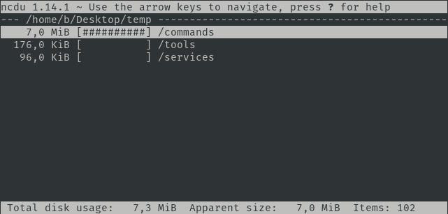

# Ncdu

Ncurses-based disk usage analyzer that provides a fast way to see which files and directories are using your disk space.

## Installation

```bash
sudo apt install ncdu
```

## Usage

```bash
ncdu <options> <directory>
```

## Flags

```bash
ncdu <options> <directory>

  -h,--help                  This help message
  -q                         Quiet mode, refresh interval 2 seconds
  -v,-V,--version            Print version
  -x                         Same filesystem
  -e                         Enable extended information
  -r                         Read only
  -o FILE                    Export scanned directory to FILE
  -f FILE                    Import scanned directory from FILE
  -0,-1,-2                   UI to use when scanning (0=none,2=full ncurses)
  --si                       Use base 10 (SI) prefixes instead of base 2
  --exclude PATTERN          Exclude files that match PATTERN
  -X, --exclude-from FILE    Exclude files that match any pattern in FILE
  -L, --follow-symlinks      Follow symbolic links (excluding directories)
  --exclude-caches           Exclude directories containing CACHEDIR.TAG
  --confirm-quit             Confirm quitting ncdu
  --color SCHEME             Set color scheme
```

## Examples

```bash
ncdu /home/b/Desktop/temp
```



## References

- [Linux.die.net](https://linux.die.net/man/1/ncdu)
- [Dev.yorhel.nl](https://dev.yorhel.nl/ncdu)
